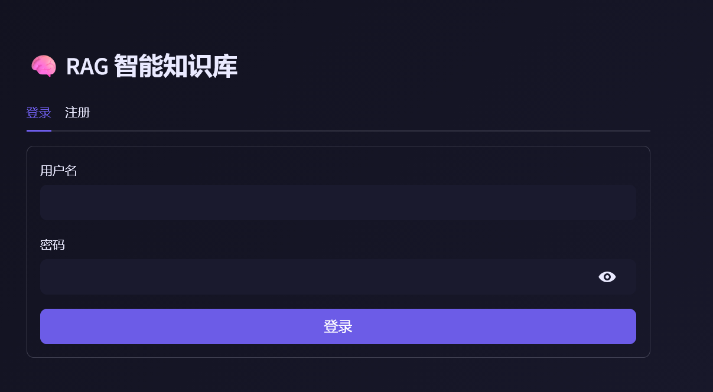
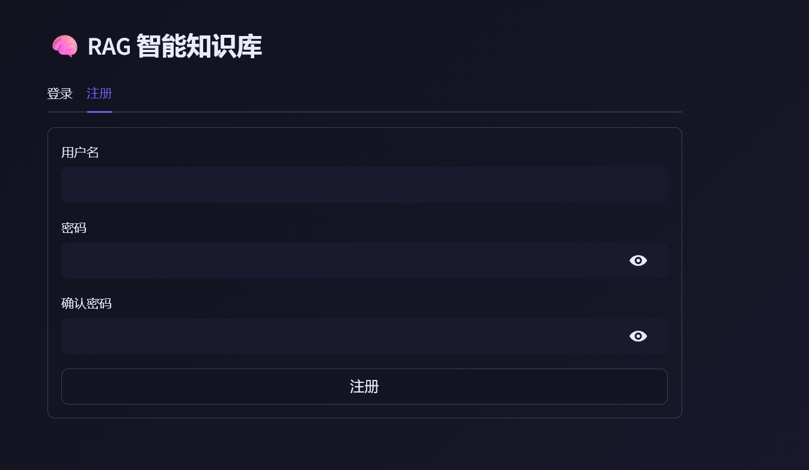
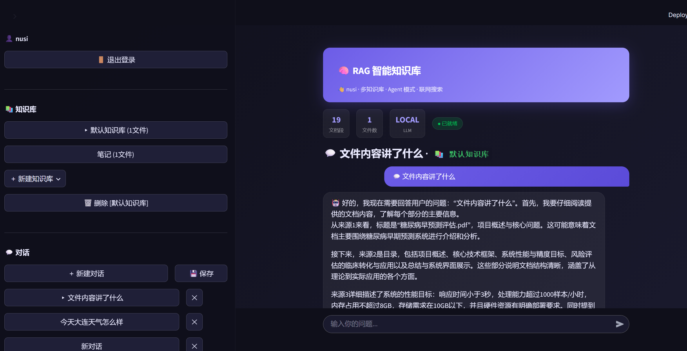
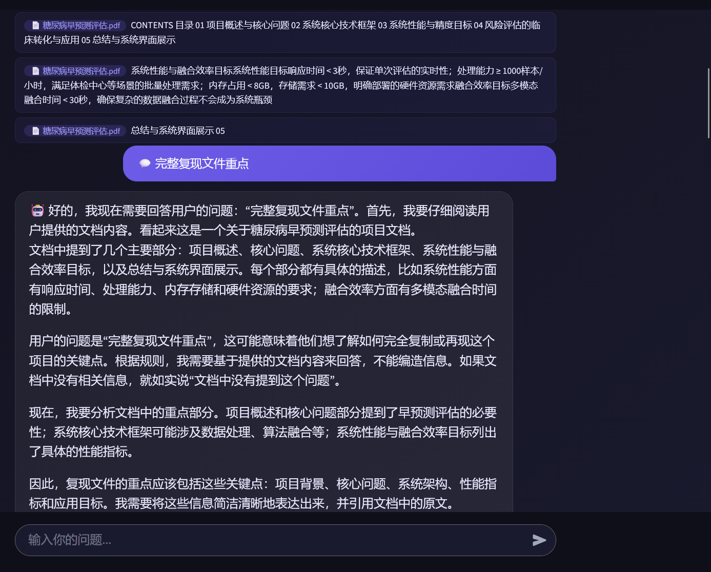
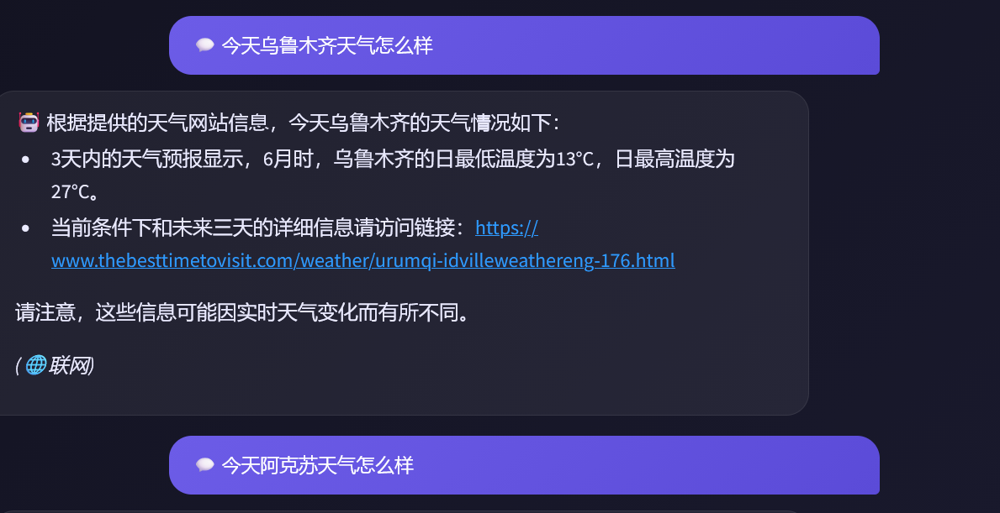

<p align="center">
  
  
  
  
  
  
</p>

<h1 align="center">🧠 RAG 智能知识库</h1>

<p align="center">
  <b>企业级 RAG 知识库问答系统</b><br>
  多用户 · 多知识库 · Agent 工具调用 · 联网搜索 · 流式输出
</p>

<p align="center">
  <i>完全本地运行，数据不出网，保护企业隐私</i>
</p>

<p align="center">
  <b>🧑‍💻 关于作者</b><br>
  计算机专业 AI 方向 · <b>Vibe Coding</b> 实践者 · 独立全栈开发者<br>
  熟练 LangChain / RAG / Agent / 大模型应用开发 · 从架构设计到部署交付一条龙<br>
  <i>"用 AI 构建 AI 产品，让技术真正落地创造价值"</i>
</p>

---

## 📋 项目简介

RAG 智能知识库是一个基于 **LangChain + ChromaDB + Ollama** 的企业级 RAG（检索增强生成）系统。它允许用户上传文档，构建私有知识库，并通过 AI 自然语言问答的方式检索和理解文档内容。

### 核心价值

| 场景 | 说明 |
|------|------|
| 🏢 **企业内部知识管理** | 将公司文档、制度、手册变成可对话的知识库 |
| 🎓 **学术论文分析** | 上传论文 PDF，快速提取关键信息 |
| 📚 **个人学习笔记** | 构建个人知识库，随时检索 |
| 💼 **接单变现** | 为企业提供私有化知识库部署服务 |

---

## ✨ 功能特性

### 核心功能
- ✅ **多用户登录** — 用户隔离，数据安全
- ✅ **多知识库** — 创建多个独立知识库，一键切换
- ✅ **多格式文档** — 支持 PDF / TXT / Markdown / Word
- ✅ **RAG 问答** — 基于文档内容的精准问答
- ✅ **Agent 模式** — AI 自动选择：知识库检索 / 联网搜索 / 计算器
- ✅ **流式输出** — 文字逐字出现，无需等待
- ✅ **多轮对话** — AI 记住上下文，连续提问
- ✅ **对话导出** — 支持 Markdown / 纯文本导出

### 技术特性
- 🔒 **数据安全** — 所有数据本地存储，不上传云端
- 🚀 **GPU 加速** — 自动检测 NVIDIA GPU，推理加速
- 🗄️ **数据库持久化** — SQLAlchemy + SQLite，替代 JSON 文件
- 🐳 **Docker 部署** — 一键 docker-compose up
- 📊 **结构化日志** — 日志文件轮转，生产可用
- 🧪 **测试覆盖** — pytest 单元测试

---

## 🖥 界面预览

<table>
  <tr>
    <td width="50%"></td>
    <td width="50%"></td>
  </tr>
</table>







---

## 🚀 快速开始

### 环境要求

- Python 3.10+
- [Ollama](https://ollama.com/)（本地大模型引擎）
- 推荐：NVIDIA GPU（可选，CPU 也可运行）

### 安装

```bash
# 1. 克隆项目
git clone https://github.com/yourusername/rag-knowledge-base.git
cd rag-knowledge-base

# 2. 安装依赖
pip install -r requirements.txt

# 3. 初始化数据库
python run.py init

# 4. 下载模型（任选一个）
ollama pull qwen2.5:3b    # 推荐：平衡速度与效果
# ollama pull qwen2.5:1.5b  # 轻量快速版

# 5. 启动
python run.py web
```

打开 **http://localhost:8501**，注册账号即可使用。

### Docker 部署

```bash
cd docker
docker-compose up -d
```

---

## 📁 项目结构

```
rag-knowledge-base/
├── app/                          # 核心应用包
│   ├── config.py                 # pydantic-settings 配置
│   ├── database.py               # SQLAlchemy 数据库
│   ├── models.py                 # ORM 模型（5 张表）
│   ├── auth.py                   # 用户认证（bcrypt + Session）
│   ├── logger.py                 # 结构化日志
│   ├── exceptions.py             # 异常体系
│   ├── rag/                      # RAG 引擎
│   │   ├── engine.py             # 问答引擎（核心）
│   │   ├── ingest.py             # 文档导入
│   │   ├── embed.py              # Embedding 管理
│   │   └── loaders.py            # 文档加载器
│   └── web/
│       └── ui.py                 # Streamlit 界面
│
├── docker/                       # Docker 部署
│   ├── Dockerfile                # 多阶段构建
│   └── docker-compose.yml        # 一键部署
│
├── scripts/                      # 运维脚本
│   ├── init_db.py                # 初始化数据库
│   └── create_admin.py           # 创建管理员
│
├── tests/                        # 测试
│   ├── conftest.py
│   └── test_auth.py
│
├── docs/                         # 文档
├── .env.example                  # 环境变量模板
├── requirements.txt
├── run.py                        # 统一入口
└── README.md
```

---

## ⚙️ 配置说明

所有配置通过环境变量或 `.env` 文件管理：

```bash
# 复制配置模板
cp .env.example .env

# 修改配置（按需）
EMBEDDING_PROVIDER=local          # local | openai
LLM_PROVIDER=local                # local | openai
OLLAMA_MODEL=qwen2.5:3b
LLM_TEMPERATURE=0.1
CHUNK_SIZE=1000
RETRIEVAL_K=6
```

---

## 🧠 技术栈

| 层级 | 技术选型 |
|------|---------|
| **LLM 引擎** | Ollama + Qwen2.5 / DeepSeek / LLaMA |
| **RAG 框架** | LangChain (LCEL) |
| **向量数据库** | ChromaDB |
| **Embedding** | BAAI/bge-small-zh-v1.5 |
| **Web 界面** | Streamlit |
| **数据库** | SQLAlchemy + SQLite |
| **认证** | bcrypt + HMAC Session |
| **部署** | Docker + docker-compose |
| **文档加载** | PyMuPDF / python-docx / Unstructured |

---

## 🔌 支持的 LLM 模型

| 模型 | 大小 | 速度 | 中文 | 推荐场景 |
|------|------|------|------|---------|
| `qwen2.5:3b` | 1.9GB | ⚡⚡⚡ | ✅ 优秀 | **推荐**，平衡速度与质量 |
| `qwen2.5:1.5b` | 1.1GB | ⚡⚡⚡⚡ | ✅ 良好 | 轻量快速 |
| `deepseek-r1:7b` | 4.7GB | ⚡ | ✅ 良好 | 数学/逻辑推理 |
| `qwen2.5:7b` | 4.0GB | ⚡⚡ | ✅ 优秀 | 高质量但较慢 |
| `gpt-4o-mini` | API | ⚡⚡⚡⚡ | ✅ 优秀 | 需要 API Key |

---

## 📊 数据库模型

系统使用 SQLAlchemy ORM，包含 5 个核心模型：

```
User (用户)
  ├── KnowledgeBase (知识库) — 用户创建的独立知识库
  │   ├── Document (文档) — 上传的源文件
  │   └── Conversation (对话) — 问答记录
  │       └── Message (消息) — 每条问答内容
  └── Conversation (对话)
```

---

## 🐳 Docker 部署

```bash
cd docker

# 启动全部服务（Ollama + RAG 应用）
docker-compose up -d

# 查看日志
docker-compose logs -f

# 停止
docker-compose down
```

---

## 🔐 安全特性

- **bcrypt 密码哈希** — 12 轮迭代，抗暴力破解
- **HMAC 签名 Session** — 防止 Token 伪造
- **用户数据隔离** — 知识库、文档、对话按用户分离
- **数据本地存储** — 不依赖任何第三方云服务
- **可配置 SECRET_KEY** — 生产环境必须替换

---

## 🧪 测试

```bash
# 运行全部测试
python -m pytest tests/ -v

# 运行特定测试
python -m pytest tests/test_auth.py -v
```

---

## 📌 版本规划

| 版本 | 内容 | 状态 |
|------|------|------|
| v1.0 | 基础 RAG 功能 | ✅ |
| v2.0 | 多知识库、Agent 模式、流式输出 | ✅ |
| v3.0 | 用户认证、数据库持久化、Docker 部署 | ✅ |
| v4.0 | 多模型接入（OpenAI/文心/通义） | 📅 计划中 |
| v4.1 | 混合检索（BM25 + Reranker） | 📅 计划中 |
| v5.0 | 多模态（图片/语音）、API 接口 | 📅 规划中 |

---

## 📄 开源协议

[MIT License](./LICENSE)

---

## 🙏 致谢

- 项目由计算机专业学生独立开发完成
- 感谢 LangChain、ChromaDB、Streamlit、Ollama、HuggingFace 等开源社区

---

<p align="center">
  <sub>Made with ❤️ · Built by <b>Vibe Coding</b> · 计算机专业 AI 方向 · 独立开发者</sub>
</p>
